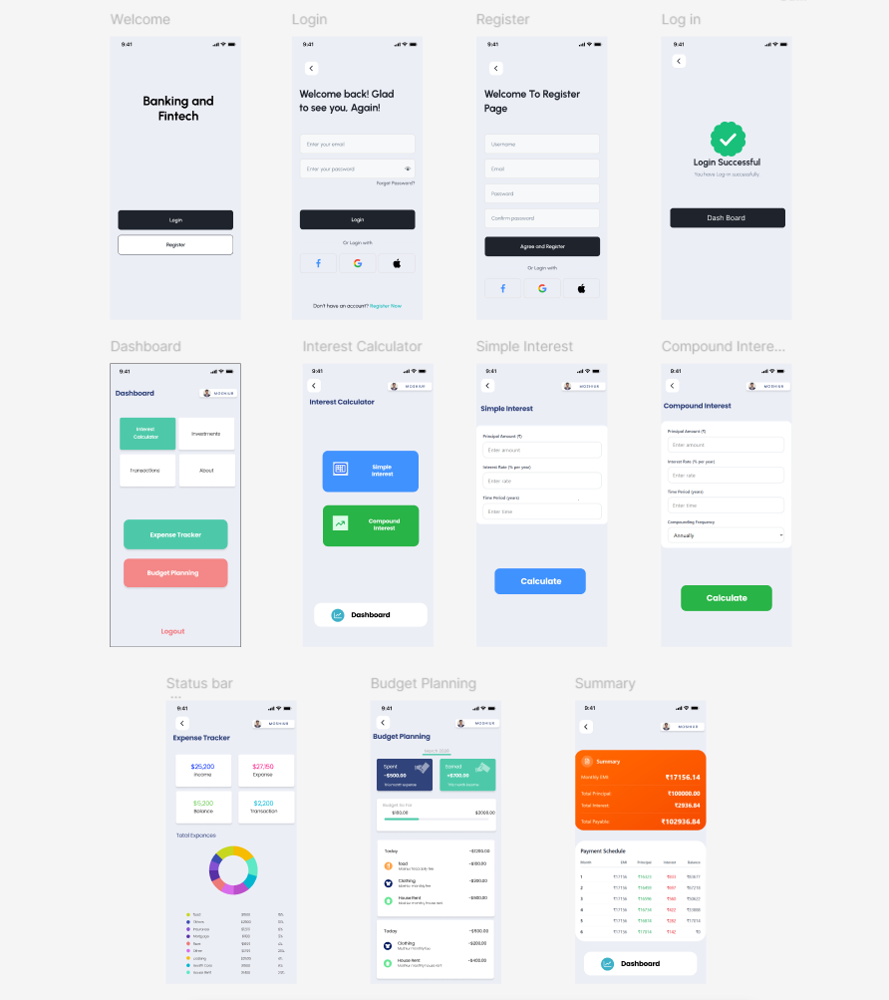

# 💳 Banking & Fintech Dashboard UI

This is my first frontend UI design project created using **Figma** as part of my Full Stack Development class.

---

## 📌 Project Overview

A modern and clean Banking / Fintech Dashboard interface that includes:

- Dashboard Layout  
- Interest Calculator  
- Investments Section  
- Transactions Page  
- Expense Tracker  
- Budget Planning  
- User Profile Section

---

## 🎯 What I Learned

- Structuring a dashboard layout  
- Maintaining proper spacing and alignment  
- Applying visual hierarchy  
- Using consistent color schemes  
- Designing real-world UI interfaces

---

## 🛠 Tools Used

- Figma

---

## 📷 Preview

(Add your exported screenshot here and name it `preview.png`)

```md

